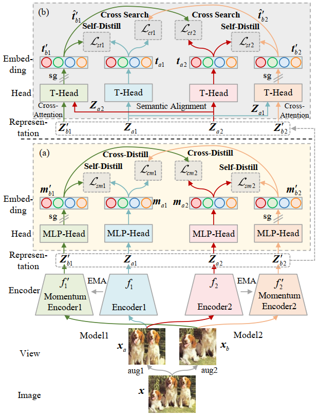

# Multi-Mode Online Knowledge Distillation for Self-Supervised Visual Representation Learning
Official Implementation of our paper "**Multi-Mode Online Knowledge Distillation for Self-Supervised Visual Representation Learning**", in **CVPR 2023**. 

by Kaiyou Song, Jin Xie, Shan Zhang and Zimeng Luo.

**[[arXiv]](https://arxiv.org/abs/2304.06461)**  **[[Paper]](https://arxiv.org/pdf/2304.06461.pdf)**

## Method
 


## Usage

### ImageNet Pre-training

This implementation  supports **DistributedDataParallel** training; single-gpu or DataParallel training is not supported.

To do pre-training of a ResNet50-ViT-S model pairs on ImageNet in an 16-gpu machine, run:

```
python3 -m torch.distributed.launch --nproc_per_node=8 \
--nnodes 2 --node_rank 0 --master_addr='100.123.45.67' --master_port='10001'  \
main_mokd.py \
--arch_cnn resnet50 --arch_vit vit_small \
--out_dim 65536 --norm_last_layer False \
--clip_grad_cnn 3 --clip_grad_vit 3 --freeze_last_layer 1 \
--optimizer sgd  \
--lr_cnn 0.1 --lr_vit 0.0003 --warmup_epochs 10 \
--use_fp16 True \
--warmup_teacher_temp 0.04 --teacher_temp 0.07 \
--warmup_teacher_temp_epochs_cnn 50 --warmup_teacher_temp_epochs_vit 30 \
--patch_size 16 --drop_path_rate 0.1 \
--local_crops_number 8 --global_crops_scale 0.25 1 --local_crops_scale 0.05 0.25 \
--momentum_teacher 0.996 \
--num_workers 10 \
--batch_size_per_gpu 16 --epochs 100 \
--lamda_t 0.1 --lamda_c 1.0 \
--data_path /path to imagenet/ \
--output_dir output/ \
```

### ImageNet Linear Classification

With a pre-trained model, to train a supervised linear classifier on frozen features/weights in an 8-gpu machine, run:

```
python3 -m torch.distributed.launch --nproc_per_node=8 eval_linear.py \
--arch resnet50 \
--lr 0.01 \
--batch_size_per_gpu 256 \
--num_workers 10 \
--pretrained_weights /path to pretrained checkpoints/xxx.pth \
--checkpoint_key teacher_cnn \
--data_path /path to imagenet/ \
--output_dir output/ \
--method mokd
```

```
python3 -m torch.distributed.launch --nproc_per_node=8 eval_linear.py \
--arch vit_small \
--n_last_blocks 4 \
--lr 0.001 \
--batch_size_per_gpu 256 \
--pretrained_weights /path to pretrained checkpoints/xxx.pth \
--checkpoint_key teacher_vit \
--data_path /path to imagenet/ \
--output_dir output/ \
--method mokd
```

### Evaluation: k-NN classification on ImageNet
To evaluate a k-NN classifier with a single GPU on a pre-trained model, run:

```
python3 -m torch.distributed.launch --nproc_per_node=8 eval_knn.py \
--arch resnet18 \
--batch_size_per_gpu 512 \
--pretrained_weights /path to pretrained checkpoints/xxx.pth \
--checkpoint_key teacher_cnn \
--num_workers 20 \
--data_path /path to imagenet/ \
--use_cuda True \
--method mokd
```

## Acknowledgement
This project is based on [DINO](https://github.com/facebookresearch/dino).
Thanks for the wonderful work.

## License
This project is under the Apache License 2.0 license. See [LICENSE](LICENSE) for details.

## Citation
```bibtex
@inproceedings{song2023multimode,
  author    = {Song, Kaiyou and Xie, Jin and Zhang, Shan and Luo, Zimeng},
  booktitle = {Proceedings of the IEEE/CVF Conference on Computer Vision and Pattern Recognition (CVPR)},
  title     = {Multi-Mode Online Knowledge Distillation for Self-Supervised Visual Representation Learning},
  year      = {2023},
}
```